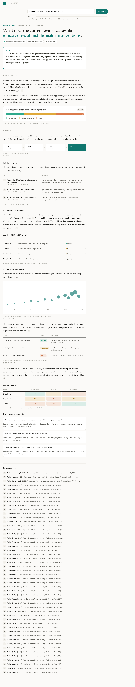

# Corpus — Front ↔ Back Interface

This document is the narrative companion to the machine-readable contract:

- **`api/types.ts`** — TypeScript types, the single source of truth.
- **`api/openapi.yaml`** — OpenAPI 3.1, mirrors `types.ts`.
- **`server/`** — a runnable, fixture-backed mock of every endpoint.
- **`js/api.js`** — a browser client (fetch + `EventSource`) plus a `ContentBlock` renderer.
- **`demo.html`** — proves the loop: it builds the whole Research Report by streaming from the API.

The goal: the frontend's hardcoded data can be replaced by live calls with **zero contract churn**,
and real literature providers can be swapped in behind the mock with **no frontend change**.

---

## 1. The big picture

```
Static frontend (multi-page)
      │  HTTP/JSON  +  SSE (report generation stream)
      ▼
API Gateway  /api/v1
      ├── /facets                  drives the filter drawer
      ├── /papers, /papers/{id}    paginated literature search
      ├── /reports*                async synthesis jobs + SSE
      ├── /saved-searches, /history
      ├── /collections*            Library / Saved
      └── /auth/*, /me
      ▼
Orchestrator → pipeline (retrieve → screen → extract → grade → synthesize)
      ▼
LiteratureProvider adapters  (Mock default · PubMed live · OpenAlex/bioRxiv/SJR to come)
```

### Three flexibility principles

1. **A report is an ordered list of typed `ContentBlock`s**, not fixed fields. The renderer
   switches on `block.type` and ignores unknown types (`CorpusRender.block` returns `''` for
   anything it doesn't know), so new figures (forest plot, GRADE summary-of-findings,
   funnel-asymmetry) ship backend-first.
2. **Citations are a first-class linking layer.** Inline markers reference a `Reference` and carry a
   `stance` (`yes | possibly | mixed | no | na`) — exactly the report's `.rr-cite[data-meter][data-title]`.
3. **One `ResearchQuery` powers both `/papers` and `/reports`**, and maps 1:1 to the drawer.

---

## 2. The core flow — generating a report

Report generation is an **async job + streaming**. The search no longer navigates with no payload;
it creates a report from a `ResearchQuery` and follows the stream.

```
POST /reports { query }                       → 202 { reportId, jobId, statusUrl, eventsUrl }
GET  /reports/{id}/events   (Server-Sent Events)
       event: status      { phase: "retrieving",  progress: 0.05, message }
       event: funnel      { stages: [...] }                     ← preview signal
       event: status      { phase: "screening",   progress: 0.18 }
       event: meter       { question, n, buckets }              ← preview signal
       event: status      { phase: "extracting",  progress: 0.30 }
       event: block       { block }    × N    (in reading order, the source of truth)
       event: status      { phase: "grading",     progress: 0.60 }
       event: status      { phase: "synthesizing",progress: 0.92 }
       event: references  { added: [...] }
       event: status      { phase: "complete",    progress: 1.0 }
       event: done        { report }            ← full SynthesisReport
GET  /reports/{id}                             → SynthesisReport (partial while running; polling fallback)
```

**`funnel` and `meter` are early preview signals** for a progress UI; the same data also arrives as
`block`s in reading order. Clients that render the block stream should treat the standalone
`funnel`/`meter` events as headline hints, not as content to render twice. `demo.html` renders only
the block stream.

### Inline citation convention

Prose HTML carries inline citations as `{{cite:N}}` tokens, where `N` is the `CitationRef.number`.
The client swaps each token for the report's marker:

```
"…coupling with the systems where the work actually happens{{cite:1}}."
        ↓  CorpusRender.injectCitations(html, citations)
"…happens<span class="rr-cite" data-meter="Yes" data-title="…">1</span>."
```

Stance → `data-meter`: `yes→Yes`, `possibly→Possibly`, `mixed→Mixed` (matching `app.js`'s color map,
now driven by CSS tokens `--c-yes / --c-possibly / --c-mixed` in `css/tokens.css`).

---

## 3. Endpoints at a glance

| Method | Path | Auth | Purpose |
|---|---|---|---|
| GET | `/facets` | public | Drawer catalogs (23 fields, 236 countries, ranks, sources, designs, modes) |
| GET | `/papers` | public | Cursor-paginated literature search |
| GET | `/papers/{id}` | public | One paper |
| POST | `/reports` | public¹ | Start an async synthesis job (`Idempotency-Key` supported) |
| GET | `/reports` | public¹ | History of generated reports |
| GET | `/reports/{id}` | public¹ | Report (partial while generating) |
| GET | `/reports/{id}/events` | public¹ | SSE generation stream |
| DELETE | `/reports/{id}` | public¹ | Delete a report |
| GET/POST | `/saved-searches` | bearer | List / save |
| DELETE | `/saved-searches/{id}` | bearer | Delete |
| GET | `/history` | bearer | Recent searches/reports |
| GET/POST | `/collections` | bearer | List / create |
| GET/PATCH/DELETE | `/collections/{id}` | bearer | Fetch / rename / delete (system collection delete → 400) |
| POST | `/collections/{id}/items` | bearer | Add item (`ref: { kind, id }`) |
| DELETE | `/collections/{id}/items/{itemId}` | bearer | Remove item |
| POST | `/auth/login` | public | Returns `{ token, user }` (mock: any credentials) |
| POST | `/auth/logout` | bearer | — |
| GET | `/me` | bearer | Current user |

¹ The mock leaves `/reports*` open for ergonomic `curl` testing. In production these are user-scoped
like the rest; the contract treats them as authenticated.

### Cross-cutting

- **Base path** `/api/v1`. Bump to `/api/v2` for breaking changes; additive changes (new block types,
  new optional fields, new facets) are **not** breaking — the renderer ignores unknown blocks and
  clients ignore unknown fields.
- **Error envelope** — every non-2xx body is `{ "error": { "code", "message", "details"? } }`.
- **Pagination** — `{ items, nextCursor?, total? }`; pass `cursor` back to page forward.
- **Idempotency** — `Idempotency-Key` header (or `idempotencyKey` in the body) on `POST /reports`
  returns the same `reportId` on replay.
- **CORS** — enabled for all origins (mock).

---

## 4. Examples

```bash
# Facets that drive the drawer
curl :8787/api/v1/facets | jq '{fields: (.fieldsOfStudy|length), countries: (.countries|length)}'
# → { "fields": 23, "countries": 236 }

# Start a synthesis job
curl -s -X POST :8787/api/v1/reports -H 'content-type: application/json' \
  -d '{"query":{"question":"mobile health interventions","mode":"keyword","filters":{}}}'
# → 202 { "reportId": "...", "eventsUrl": "/api/v1/reports/.../events", ... }

# Watch the stream
curl -N :8787/api/v1/reports/<id>/events
# → event: status … funnel … meter … block ×28 … references … done

# Literature search (live PubMed when USE_LIVE_PUBMED=1)
curl ':8787/api/v1/papers?query=mobile%20health&limit=5' | jq '.total'

# Authenticated round-trip
TOKEN=$(curl -s -X POST :8787/api/v1/auth/login -H 'content-type: application/json' \
  -d '{"email":"r@x.dev","password":"x"}' | jq -r .token)
curl :8787/api/v1/collections -H "authorization: Bearer $TOKEN"
```

---

## 5. Provider layer (backend-internal)

`LiteratureProvider` normalizes any source to one `Paper`:

```ts
interface LiteratureProvider {
  id: string;
  capabilities: { citations; quartile; openAccess; fullText; fields; countries };
  search(q: ResearchQuery, page): Promise<{ items: Paper[]; total?; nextCursor? }>;
  fetch(ids: string[]): Promise<Paper[]>;
}
```

- **MockProvider** — fixtures; the default.
- **PubMedProvider** — real NCBI E-utilities (`esearch`/`efetch`); maps `ResearchQuery` → PubMed
  syntax (`mode:author→[Author]`, `mode:title→[Title]`, `studyDesigns→Publication Type[]`,
  `fields→MeSH`, `yearMin/Max→mindate/maxdate`). No citation counts (left for enrichment). Enable
  with `USE_LIVE_PUBMED=1`.
- **Aggregator** — fans out, dedups by DOI, applies shared post-filters (`minCitations`,
  `journalRank`, `excludePreprints`, `openAccess`, year, sample size, fields, countries, designs).

Adding OpenAlex / bioRxiv / an SJR quartile enricher is a backend-only change: implement the
interface and register it in `server/src/providers/aggregator.ts`.

---

## 6. Frontend element → contract mapping

The mock fixtures reproduce today's pages exactly (verified live in `demo.html`):

| Frontend element | Contract target |
|---|---|
| Filter drawer catalogs (`index.html:106-188`) | `GET /facets` |
| Search submit (`paper-search.js:11,176`, no payload today) | `POST /reports` with `ResearchQuery`; carry `reportId` |
| Header chips: consensus, "17 contributing studies", "Updated weekly", "~6 min read", "Generated Jun 2026" | `consensus`, `metrics.contributingStudies`, `cadence`, `readingTimeMin`, `generatedAt` |
| TL;DR | `block{type:"tldr"}` |
| Consensus meter — N=17, 4/7/6 | `block{type:"consensusMeter"}` + `meter` event |
| Funnel — 7.5M→142k→131→50 | `report.funnel` + `block{type:"funnel"}` + `funnel` event |
| Key papers — badges 7/5/4 | `block{type:"keyPapers"}` |
| Hot areas — A–D, Strong/Moderate/Emerging, 14/9/7/5 | `block{type:"evidenceMatrix"}` |
| Timeline — 13 markers (year × citations) | `block{type:"timeline"}` |
| Claims — Strong/Moderate/Weak + reasoning | `block{type:"claims"}` |
| Gap heatmap — Long-term/Equity/Integration × HIGH/MED/LOW | `block{type:"gapHeatmap"}` |
| Open questions — 3 Q/A | `block{type:"openQuestions"}` |
| References — 50 total | `report.references[]` (replaces `buildPlaceholderRefs()`) |
| Inline `.rr-cite[data-meter][data-title]` | `CitationRef{ stance, tooltip }` via `{{cite:N}}` tokens |



---

## 7. Wiring the existing pages (follow-up)

This deliverable ships the contract, the mock, the client, and a working proof (`demo.html`). Fully
replacing the hardcoded data in `index.html` / `report.html` is a mechanical follow-up:

1. **`index.html`** — on submit, read the drawer into a `ResearchQuery`, `POST /reports`, then
   navigate to a report view with the `reportId`.
2. **`report.html`** — replace the static body with `CorpusApi.streamReport(reportId, …)` driving
   `CorpusRender.block`, and **delete `buildPlaceholderRefs()`** in `js/app.js` (refs now come from
   `report.references`). `demo.html` is the reference implementation of this view.

No contract changes are needed for that work — that is the point.
